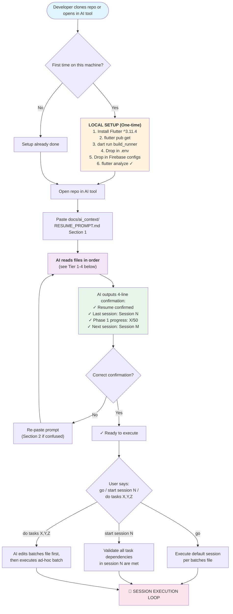
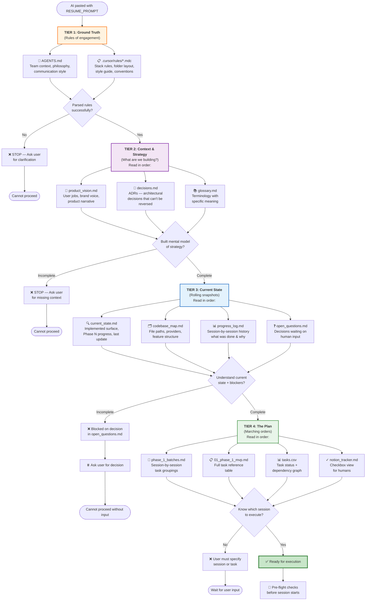
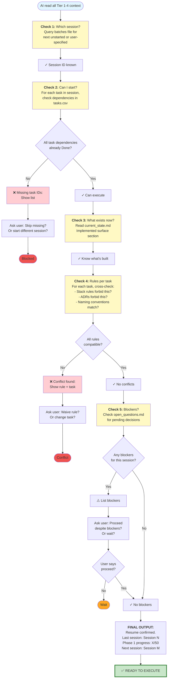
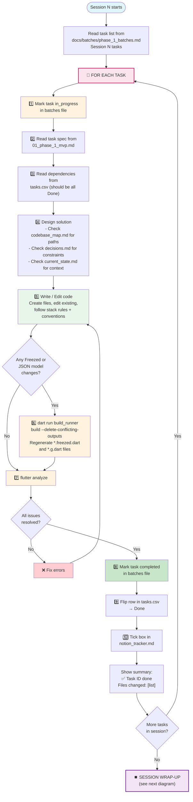
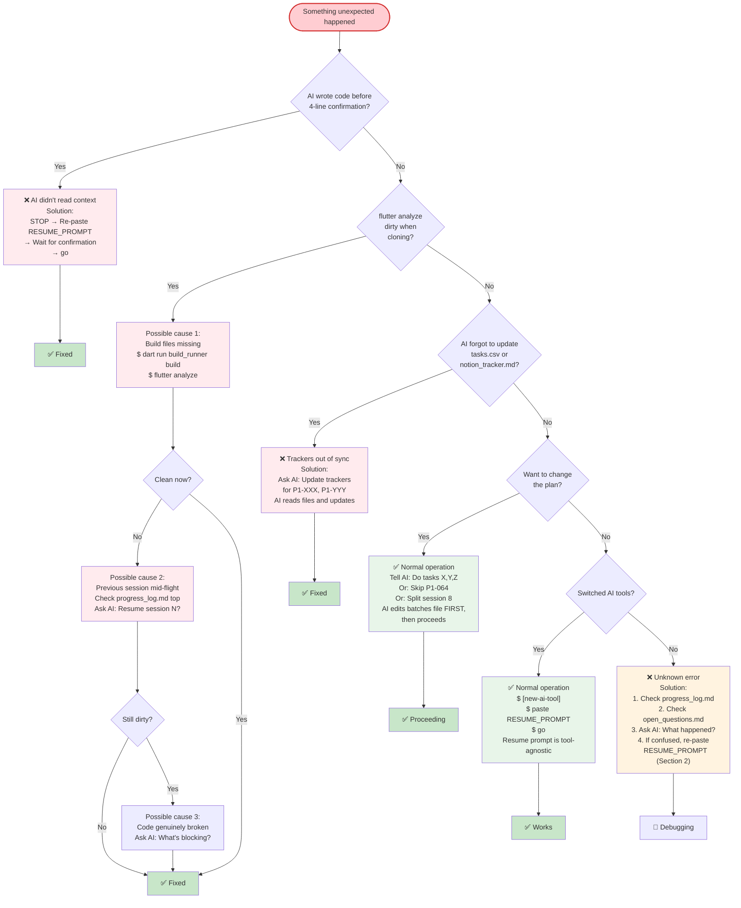

# AI Development Architecture
## Visual Flowchart: How AI Develops JourneyPlus

This document provides visual representations of the complete AI-driven development procedure for JourneyPlus. Use this to understand the decision flow, execution loop, and context hierarchy.

---

## 1. Initial Entry Point: Fresh Clone or Resume



---

## 2. Information Hierarchy: What AI Reads (In Order)



---

## 3. Pre-Flight Checks: Before Session Starts



---

## 4. Session Execution Loop: Per-Task Flow



---

## 5. Session Wrap-Up: After All Tasks Done

```mermaid
flowchart TD
    Start([All tasks in session completed]) --> Step1["<b>Step 1: Append to progress_log.md</b><br/>- Add to TOP of file<br/>- Format: ## Session N — Theme<br/>- Content: What was done,<br/>  key decisions, blockers"]
    
    Step1 --> S1["✅ Progress log updated"]
    
    S1 --> Step2["<b>Step 2: Refresh codebase_map.md</b><br/>- List new files created<br/>- List new providers added<br/>- Update feature structure<br/>- Update file paths"]
    
    Step2 --> S2["✅ Codebase map refreshed"]
    
    S2 --> Step3["<b>Step 3: Refresh current_state.md</b><br/>- Update 'Implemented surface'<br/>  bullets with new feature<br/>- Update Phase N progress % <br/>- Update 'Last updated' timestamp<br/>- Remove from 'NOT implemented'<br/>  if task was completion-level"]
    
    Step3 --> S3["✅ Current state updated"]
    
    S3 --> Step4["<b>Step 4: Mark session done</b><br/>in batches file<br/>- Change session status<br/>  from 🔵 to ✅"]
    
    Step4 --> S4["✅ Batches file updated"]
    
    S4 --> Step5["<b>Step 5: Show commit message</b><br/>Format:<br/>feat(phase1): SESSION_THEME (session N)<br/><br/>Example:<br/>feat(phase1): trip dashboard +<br/>trip foundation (session 7)"]
    
    Step5 --> S5["✅ Commit message ready"]
    
    S5 --> Step6["<b>Step 6: Stop — user commits</b><br/>User runs:<br/>$ git add -A<br/>$ git commit -m '...'<br/>$ git push"]
    
    Step6 --> Done["✅ SESSION COMPLETE<br/>Ready for next session"]
    
    Done --> NextSession["<b>Tomorrow:</b><br/>$ git pull<br/>$ [open-ai-tool]<br/>$ paste RESUME_PROMPT<br/>$ go"]
    
    style Start fill:#e1f5ff,stroke:#01579b,stroke-width:2px
    style Step1 fill:#f3e5f5
    style Step2 fill:#f3e5f5
    style Step3 fill:#f3e5f5
    style Step4 fill:#f3e5f5
    style Step5 fill:#f3e5f5
    style Step6 fill:#ffe0b2
    style Done fill:#c8e6c9,stroke:#2e7d32,stroke-width:3px
    style NextSession fill:#e0f2f1,stroke:#00695c,stroke-width:2px
```



---

## 6. Error Handling: What to Do When Things Break



---

## 7. Complete Workflow: Start to Finish (End-to-End)

```mermaid
flowchart TD
    Day1Start([Day 1: Fresh clone]) --> Day1Setup["⚙️ ONE-TIME SETUP<br/>1. Install Flutter<br/>2. pub get<br/>3. build_runner<br/>4. .env + Firebase<br/>5. flutter analyze ✓"]
    
    Day1Setup --> Day1Open["🛠️ Open in AI tool"]
    Day1Open --> Day1Paste["📋 Paste RESUME_PROMPT"]
    Day1Paste --> Day1Confirm["✅ AI confirms<br/>Last session: none<br/>Phase 1: 0/50<br/>Next: Session 1"]
    Day1Confirm --> Day1Go["👉 You: go"]
    
    Day1Go --> S1Loop["🔄 SESSION 1 LOOP<br/>- 8 tasks<br/>- Write foundation models<br/>- build_runner after each<br/>- flutter analyze ✓"]
    
    S1Loop --> S1Done["✅ All 8 tasks done<br/>- Update progress_log<br/>- Update codebase_map<br/>- Update current_state<br/>- Mark session ✅"]
    
    S1Done --> S1Commit["📝 Show commit msg:<br/>feat(phase1): foundation models + rebrand (session 1)"]
    S1Commit --> Day1You["👉 You: git commit"]
    
    Day1You --> Day2Start([Day 2: Resume])
    
    Day2Start --> Day2Pull["$ git pull"]
    Day2Pull --> Day2Open2["🛠️ Open in AI tool"]
    Day2Open2 --> Day2Paste2["📋 Paste RESUME_PROMPT"]
    Day2Paste2 --> Day2Confirm2["✅ AI confirms<br/>Last session: Session 1<br/>Phase 1: 8/50<br/>Next: Session 2"]
    Day2Confirm2 --> Day2Go["👉 You: go"]
    
    Day2Go --> S2Loop["🔄 SESSION 2 LOOP<br/>- 6 tasks<br/>- Profile + POI scaffold<br/>- build_runner after each<br/>- flutter analyze ✓"]
    
    S2Loop --> S2Done["✅ All 6 tasks done<br/>- Update progress_log<br/>- Update codebase_map<br/>- Update current_state"]
    
    S2Done --> S2Commit["📝 Show commit msg:<br/>feat(phase1): profile experience + poi scaffold (session 2)"]
    S2Commit --> Day2You["👉 You: git commit"]
    
    Day2You --> Repeat["... Repeat for Sessions 3-11 ..."]
    
    Repeat --> S11["🔄 SESSION 11 (VERIFY)<br/>- End-to-end tests<br/>- All Phase 1 checklist"]
    
    S11 --> S11Done["✅ Phase 1 verification<br/>- Update current_state<br/>- Prepare Phase 2"]
    
    S11Done --> S11Commit["📝 feat(phase1): phase 1 mvp complete (session 11)"]
    S11Commit --> TagCommit["$ git tag phase-1-mvp-complete"]
    
    TagCommit --> Phase2Start["🎉 Phase 2 starts tomorrow<br/>Create docs/batches/phase_2_batches.md<br/>Update RESUME_PROMPT<br/>Same workflow continues"]
    
    style Day1Start fill:#e1f5ff,stroke:#01579b,stroke-width:2px
    style Day1Setup fill:#fff3e0
    style Day1Confirm fill:#c8e6c9
    style S1Loop fill:#fce4ec
    style S1Done fill:#c8e6c9
    style Day2Start fill:#e0f2f1,stroke:#00695c,stroke-width:2px
    style Day2Confirm2 fill:#c8e6c9
    style S2Loop fill:#fce4ec
    style S2Done fill:#c8e6c9
    style S11 fill:#f3e5f5
    style Phase2Start fill:#c8e6c9,stroke:#2e7d32,stroke-width:3px
```



---

## 8. Context Flow: How Information Moves

```mermaid
graph LR
    subgraph "Session N-1 (Yesterday)"
        S_N_1_Code["Write code<br/>Session N-1"]
        S_N_1_Tests["flutter analyze ✓<br/>All clean"]
        S_N_1_Update["Update docs/<br/>- progress_log<br/>- codebase_map<br/>- current_state<br/>- tasks.csv<br/>- notion_tracker"]
        S_N_1_Commit["git commit<br/>Session N-1"]
        
        S_N_1_Code --> S_N_1_Tests
        S_N_1_Tests --> S_N_1_Update
        S_N_1_Update --> S_N_1_Commit
    end
    
    S_N_1_Commit --> Push["git push<br/>to origin/main"]
    
    subgraph "Session N (Today)"
        S_N_Start["git pull<br/>Get Session N-1 commits"]
        S_N_Paste["Paste RESUME_PROMPT"]
        S_N_Read["AI reads in order:<br/>- Tier 1: Rules<br/>- Tier 2: Strategy<br/>- Tier 3: Current state<br/>  (includes yesterday's<br/>   progress_log entry)<br/>- Tier 4: The plan"]
        S_N_Confirm["AI outputs:<br/>Last session: Session N-1<br/>Next: Session N"]
        S_N_Code["Write code<br/>Session N"]
        S_N_Tests["flutter analyze ✓"]
        S_N_Update["Update docs/<br/>- progress_log<br/>- codebase_map<br/>- current_state"]
        S_N_Commit["git commit<br/>Session N"]
        
        S_N_Start --> S_N_Paste
        S_N_Paste --> S_N_Read
        S_N_Read --> S_N_Confirm
        S_N_Confirm --> S_N_Code
        S_N_Code --> S_N_Tests
        S_N_Tests --> S_N_Update
        S_N_Update --> S_N_Commit
    end
    
    Push --> S_N_Start
    S_N_Commit --> NextDay["Next day:<br/>git pull<br/>repeat"]
    
    style S_N_1_Code fill:#fff3e0
    style S_N_1_Commit fill:#c8e6c9
    style S_N_Read fill:#f3e5f5,stroke:#6a1b9a,stroke-width:2px
    style S_N_Confirm fill:#c8e6c9
    style S_N_Code fill:#fff3e0
    style S_N_Commit fill:#c8e6c9
    style NextDay fill:#e0f2f1,stroke:#00695c,stroke-width:2px
```



---

## Summary: The 7-Step AI Developer Checklist

```
Day 1: Fresh Clone
─────────────────────────────────────────────────────────────
 1. ✓ Clone repo
 2. ✓ Install Flutter + run pub get + build_runner
 3. ✓ Drop in .env + Firebase configs
 4. ✓ flutter analyze (should be clean)
 5. ✓ Open in AI tool
 6. ✓ Paste RESUME_PROMPT (section 1 only)
 7. ✓ Wait for 4-line confirmation from AI
 8. ✓ Say "go" to start Session 1

Day 2+: Resume
─────────────────────────────────────────────────────────────
 1. ✓ git pull (get yesterday's commit)
 2. ✓ Open in AI tool (can be different tool)
 3. ✓ Paste RESUME_PROMPT (section 1 only)
 4. ✓ Wait for 4-line confirmation from AI
 5. ✓ Say "go" to start next session
 6. ✓ When session finishes, git commit (user does this)
 7. ✓ Repeat daily

Per-Session Loop (AI does this)
─────────────────────────────────────────────────────────────
 FOR each task in session:
   1. ✓ Write code
   2. ✓ If Freezed changed: dart run build_runner
   3. ✓ flutter analyze
   4. ✓ Update tasks.csv (mark Done)
   5. ✓ Update notion_tracker (tick box)

 After all tasks:
   1. ✓ Append to progress_log.md
   2. ✓ Refresh codebase_map.md
   3. ✓ Refresh current_state.md
   4. ✓ Mark session ✅ in batches file
   5. ✓ Show commit message
   6. ✓ STOP (user commits)
```

---

**See `docs/AI_DEVELOPMENT_WORKFLOW.md` for the complete written guide with all details, examples, and error recovery procedures.**
