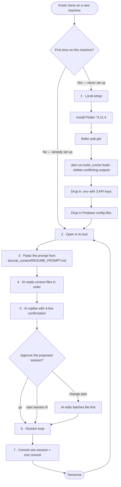
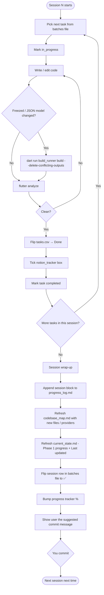

# AI Development Onboarding

> **Audience.** *You* — a human who just cloned the TripPlus repo, possibly on
> a brand-new machine, and wants to continue building it with an AI coding
> tool (Claude Code, Cursor, Codex CLI, Continue, etc.).
>
> **Goal of this file.** Be the *single* document you read on a fresh clone.
> Tells you how to wake the project up and put an AI back in the driver's
> seat in under ten minutes.

---

## TL;DR

1. Clone, install Flutter, run `pub get` + `build_runner`, drop in `.env` and Firebase configs.
2. Open the repo in your AI tool.
3. Paste the prompt from [`docs/ai_context/RESUME_PROMPT.md`](ai_context/RESUME_PROMPT.md) section 1.
4. The AI reads the docs, tells you which session is next, and waits for your "go".
5. The AI does the session; you commit at the end.

Everything else in this file is the longer explanation of those five steps.

---

## The big picture



---

## What the AI reads, in order

This is the path the prompt tells the AI to follow. Knowing it helps you
understand *why* it asks the questions it asks.

```mermaid
flowchart LR
    A1[AGENTS.md<br/><i>repo-wide ground truth</i>] --> A2
    A2[.cursor/rules/*.mdc<br/><i>stack + folder + style rules</i>] --> A3
    A3[docs/context/product_vision.md<br/><i>what we are building</i>] --> A4
    A4[docs/context/decisions.md<br/><i>ADRs — don't break these</i>] --> A5
    A5[docs/context/glossary.md<br/><i>terms with specific meaning</i>] --> A6
    A6[docs/context/current_state.md<br/><i>what exists today</i>] --> A7
    A7[docs/ai_context/codebase_map.md<br/><i>file paths cheat-sheet</i>] --> A8
    A8[docs/ai_context/progress_log.md<br/><i>session-wise history</i>] --> A9
    A9[docs/ai_context/open_questions.md<br/><i>anything blocked on you</i>] --> A10
    A10[<b>docs/batches/phase_1_batches.md</b><br/><i>THE SESSION PLAN</i>] --> A11
    A11[project_plan/01_phase_1_mvp.md<br/><i>full task table</i>] --> A12
    A12[project_plan/tasks.csv<br/><i>status + dependency graph</i>] --> A13
    A13[project_plan/notion_tracker.md<br/><i>checkbox view</i>]
```



Bold = where the AI looks for "which tasks are in this session". Everything
above it is context that lets the AI understand *why* those tasks are
grouped that way.

---

## The session execution loop

Once you say "go", the AI runs this loop per task:



---

## Step-by-step setup on a new machine

### 1. Clone the repo

```bash
git clone <your-repo-url> tripplus
cd tripplus
```

### 2. Install Flutter

You need **Flutter `^3.11.4`** (Dart 3.x). Check with:

```bash
flutter --version
```

If you don't have it, install from <https://docs.flutter.dev/get-started/install>.

### 3. Install dependencies

```bash
flutter pub get
dart run build_runner build --delete-conflicting-outputs
```

The second command regenerates all the `*.freezed.dart` and `*.g.dart` files
the Freezed models depend on.

### 4. Configure `.env`

Create a `.env` file at the repo root:

```env
GOOGLE_MAPS_API_KEY=your-google-maps-key
GOOGLE_PLACES_API_KEY=your-places-key
OPEN_CHARGE_MAP_API_KEY=your-ocm-key
```

These are also referenced from `README.md`.

### 5. Configure Firebase

Drop the standard files into the standard paths:

| Platform | File | Path |
|---|---|---|
| Android | `google-services.json` | `android/app/` |
| iOS / macOS | `GoogleService-Info.plist` | `ios/Runner/`, `macos/Runner/` |

These come from your Firebase console. The project uses Auth + Firestore (no
Storage). Crashlytics is wired in Dart but Android native gradle plugin is
still owed to `P2-071` — see [`docs/ai_context/progress_log.md`](ai_context/progress_log.md).

### 6. Sanity check

```bash
flutter analyze
flutter run    # optional — boots the app on a connected device / simulator
```

`flutter analyze` should print **"No issues found!"**. If it doesn't, your
clone might be on a half-finished session — check `git status` and
`docs/ai_context/progress_log.md` for the newest session.

### 7. Open the repo in your AI tool

Any of:

- **Claude Code** (CLI) — `claude` in the repo root.
- **Cursor** — open the folder.
- **Codex CLI** — `codex` in the repo root.
- **Continue** (VS Code extension).
- Any other AI tool that can read repo files and accept a prompt.

### 8. Paste the resume prompt

Open [`docs/ai_context/RESUME_PROMPT.md`](ai_context/RESUME_PROMPT.md),
copy **everything inside the box in section 1**, paste it into the AI's
input, hit send.

### 9. Wait for the four-line reply

The AI is instructed to reply with exactly four lines before doing anything:

```
Resume confirmed.
Last session: Session 6 — POI community pulses + four-tab shell
Phase 1 progress: 30 / 50 = 60%
Next session per batches file: Session 7 — Trip Dashboard + Trip foundation
Proposed tasks: P1-018, P1-019, P1-040, P1-041, P1-017
                ↳ <one-line why-now per task>
```

If the AI starts writing code without that four-line confirmation, **stop it
and re-paste the prompt** — it didn't read the rules.

### 10. Say "go" (or redirect)

| You say | AI does |
|---|---|
| `go` | Starts the proposed session, one task at a time. |
| `start session N` | Jumps to session N, validates deps first. |
| `do tasks P1-XXX, P1-YYY` | Runs an ad-hoc batch; **edits the batches file first**. |
| `split / merge sessions` | Re-balances the plan; edits the batches file first. |

---

## File reference

What each file is and when it gets touched.

| File | Owner | Read when | Written when |
|---|---|---|---|
| `AGENTS.md` | repo | resume | rarely (manual) |
| `.cursor/rules/*.mdc` | repo | resume | rarely (manual) |
| `README.md` | repo | first clone | manual |
| `docs/context/product_vision.md` | repo | resume | manual |
| `docs/context/decisions.md` | repo | resume | when adding an ADR |
| `docs/context/glossary.md` | repo | resume | when adding a term |
| `docs/context/current_state.md` | rolling | resume | end of every session |
| `docs/ai_context/codebase_map.md` | rolling | resume | end of every session |
| `docs/ai_context/progress_log.md` | rolling | resume | end of every session |
| `docs/ai_context/open_questions.md` | rolling | resume | when AI needs a decision |
| `docs/ai_context/RESUME_PROMPT.md` | repo | first clone | when conventions change |
| `docs/batches/phase_1_batches.md` | rolling | resume + before every task | end of every session |
| `docs/AI_DEV_ONBOARDING.md` (this file) | repo | first clone | manual |
| `project_plan/01_phase_1_mvp.md` | repo | resume | manual |
| `project_plan/tasks.csv` | rolling | per task | after every task |
| `project_plan/notion_tracker.md` | rolling | per task | after every task |
| `lib/**` | code | as needed | as tasks land |

"Rolling" = updated automatically as part of the session loop. "Repo" =
mostly static, only changes when conventions or plans change.

---

## What a typical day looks like

```
You      $ git pull                       # Yesterday's session is in main.
You      $ claude                         # Or cursor, codex, etc.
You      [paste docs/ai_context/RESUME_PROMPT.md section 1]

AI       Resume confirmed.
         Last session: Session 6 …
         Phase 1 progress: 30 / 50 = 60%
         Next session per batches file: Session 7 — Trip Dashboard
         Proposed tasks: P1-018, P1-019, P1-040, P1-041, P1-017

You      go

AI       Starting P1-018 — Extend PlanResult model…
         [writes code, runs build_runner, analyze]
         P1-018 done. Trackers updated.

AI       Starting P1-019 — Trip Dashboard widget…
         […]

         (Repeats for all 5 tasks.)

AI       Session 7 complete. flutter analyze clean.
         Files changed: <list>
         Suggested commit message:
         <message block>
         Next session per batches file: Session 8 — Smart Timeline + Active trip

You      $ git add -A
You      $ git commit -m "feat(phase1): trip dashboard + trip foundation (session 7)"
You      $ git push
```

That's the whole loop. Each commit is one session. Each session is a
self-contained chunk of work.

---

## Common questions

### "I'm on a different AI tool than last time. Does it matter?"

No. The resume prompt is tool-agnostic — it just instructs the AI to read
specific files and follow a specific protocol. As long as your tool can
read repo files and accept a long prompt, it works.

### "Can I skip the resume prompt and just say 'continue'?"

You can, but you'll get worse output. The AI hasn't seen the previous
session's chat. Without the prompt it will improvise — probably re-deriving
batches, possibly violating conventions. The prompt is short — paste it.

### "I want to do something off the plan."

Tell the AI directly. For example:

- "Before session 7, fix the typo in `lib/main.dart`."
- "Skip `P1-064` for now, I want to evaluate Sentry instead."
- "Split session 8 — the active trip work is bigger than I expected."

The AI is instructed to edit `docs/batches/phase_1_batches.md` *before*
deviating from the plan, so the change is tracked.

### "Where are open questions parked?"

[`docs/ai_context/open_questions.md`](ai_context/open_questions.md). The AI
adds to it when it hits a decision that needs you. Check it on resume.

### "Tests?"

Phase 1 is MVP — there are no unit/widget tests yet. Phase 2's `P2-070`
introduces the testing baseline. For now, `flutter analyze` is the
guardrail and visual checks via `flutter run` are the validation.

### "What if `flutter analyze` is dirty when I clone?"

Either (a) the build_runner outputs aren't generated yet (run `dart run
build_runner build --delete-conflicting-outputs`), or (b) the previous
session left mid-flight (check `docs/ai_context/progress_log.md` — the
top entry will say so).

### "The AI wrote files but didn't update tasks.csv."

Stop it and remind it. The rule in `RESUME_PROMPT.md` STEP 3 says to flip
the row in `tasks.csv` and tick `notion_tracker.md` immediately on each
completion. If it forgot, ask it to update them retroactively for the tasks
it just did.

---

## When Phase 1 ends

The last session is **Session 11 — Phase 1 completion verification**. After
it lands:

1. Create `docs/batches/phase_2_batches.md` from
   `project_plan/02_phase_2_intelligence.md` using the same template as
   `phase_1_batches.md`.
2. Update `docs/ai_context/RESUME_PROMPT.md` STEP 1 file #12 to point at
   the new batches file.
3. Update `docs/context/current_state.md` to note Phase 1 shipped.
4. Tag the git commit: `phase-1-mvp-complete`.

The same loop continues for Phase 2, then Phase 3, then Phase 4.

---

## One-line summary

**You set up Flutter once, drop in the configs, then for every session:
`git pull` → open AI tool → paste resume prompt → say "go" → commit.**
