# Cold Start Guide: What a Fresh AI Does First

> **If you're a completely new AI with ZERO context, follow this exact sequence.**

This guide shows **exactly where to start** when you have nothing but a cloned repo.

---

## 🧠 Mental Model

A fresh AI needs to answer these questions **in order**:

```
1. What is this project?              → AGENTS.md
2. What are the rules I must follow?  → .cursor/rules/*.mdc
3. What's the development workflow?   → README_FOR_AI_DEVS.md
4. How do I execute work?             → AI_DEVELOPMENT_WORKFLOW.md
5. What visual flows exist?           → AI_DEVELOPMENT_ARCHITECTURE.md
6. What's the product?                → docs/context/product_vision.md
7. What decisions are locked?         → docs/context/decisions.md
8. What's already built?              → docs/context/current_state.md
9. Where are the files?               → docs/ai_context/codebase_map.md
10. What happened before me?          → docs/ai_context/progress_log.md
11. What's blocking?                  → docs/ai_context/open_questions.md
12. What tasks am I doing?            → docs/batches/phase_1_batches.md
13. What's the full task spec?        → project_plan/01_phase_1_mvp.md
```

---

## 📊 The Cold Start Flowchart

```mermaid
flowchart TD
    AI["🤖 Fresh AI opens repo"] --> Q1["<b>Question 1:</b><br/>What is this project?"]
    
    Q1 --> A1["📖 Read: AGENTS.md<br/><br/>Output:<br/>- TripPlus = Smart Highway Companion<br/>- Flutter app for Indian road trips<br/>- Stack: Riverpod, Freezed, Firebase<br/>- Folder structure: feature-slice<br/>- Tech stack constraints"]
    
    A1 --> Q2["<b>Question 2:</b><br/>What rules must I follow?"]
    
    Q2 --> A2["📋 Read: .cursor/rules/*.mdc<br/><br/>Output:<br/>- Naming conventions<br/>- Code style<br/>- Folder structure rules<br/>- What NOT to do<br/>- Pattern matching"]
    
    A2 --> Q3["<b>Question 3:</b><br/>What's the development workflow?"]
    
    Q3 --> A3["🗺️ Read: README_FOR_AI_DEVS.md<br/><br/>Output:<br/>- Start here → AI_DEV_ONBOARDING<br/>- First 5 minutes checklist<br/>- Daily workflow (5 steps)<br/>- Error recovery map"]
    
    A3 --> Q4["<b>Question 4:</b><br/>How do I execute?"]
    
    Q4 --> A4["📚 Read: AI_DEVELOPMENT_WORKFLOW.md<br/><br/>Output:<br/>- Information hierarchy (Tier 1-4)<br/>- Decision framework (5 checks)<br/>- Session execution loop<br/>- Error recovery (6 scenarios)<br/>- Documentation lifecycle"]
    
    A4 --> Q5["<b>Question 5:</b><br/>Visual? I'm a visual learner"]
    
    Q5 --> A5["📊 Read: AI_DEVELOPMENT_ARCHITECTURE.md<br/><br/>Output:<br/>- 8 flowcharts showing:<br/>  1. Entry point<br/>  2. Info hierarchy<br/>  3. Pre-flight checks<br/>  4. Task loop<br/>  5. Wrap-up<br/>  6. Error handling<br/>  7. End-to-end<br/>  8. Context flow"]
    
    A5 --> Q6["<b>Question 6:</b><br/>What are we building?"]
    
    Q6 --> A6["🎯 Read: docs/context/product_vision.md<br/><br/>Output:<br/>- User problems we solve<br/>- Brand voice<br/>- Product roadmap<br/>- Why each phase exists"]
    
    A6 --> Q7["<b>Question 7:</b><br/>What decisions are locked?"]
    
    Q7 --> A7["🔐 Read: docs/context/decisions.md<br/><br/>Output:<br/>- Architecture decisions (ADRs)<br/>- Why we chose specific tech<br/>- What NOT to change<br/>- Trade-offs made"]
    
    A7 --> Q8["<b>Question 8:</b><br/>What exists today?"]
    
    Q8 --> A8["📸 Read: docs/context/current_state.md<br/><br/>Output:<br/>- Implemented features<br/>- Phase 1 progress %<br/>- What's orphan code<br/>- Architecture invariants"]
    
    A8 --> Q9["<b>Question 9:</b><br/>Where are the files?"]
    
    Q9 --> A9["🗂️ Read: docs/ai_context/codebase_map.md<br/><br/>Output:<br/>- lib/core/ paths<br/>- lib/features/ structure<br/>- Provider names<br/>- Hive box names<br/>- Service locations"]
    
    A9 --> Q10["<b>Question 10:</b><br/>What happened before?"]
    
    Q10 --> A10["📝 Read: docs/ai_context/progress_log.md<br/>TOP ENTRY ONLY<br/><br/>Output:<br/>- Last completed session<br/>- Tasks that landed<br/>- Key decisions made<br/>- Blockers if any"]
    
    A10 --> Q11["<b>Question 11:</b><br/>What's blocking?"]
    
    Q11 --> A11["❓ Read: docs/ai_context/open_questions.md<br/><br/>Output:<br/>- Decisions pending human input<br/>- Blocked tasks<br/>- Unclear specs"]
    
    A11 --> Q12["<b>Question 12:</b><br/>What am I building?"]
    
    Q12 --> A12["📅 Read: docs/batches/phase_1_batches.md<br/><br/>Output:<br/>- Session groupings<br/>- Next session ID<br/>- Task IDs in this session<br/>- Task estimates<br/>- Dependencies"]
    
    A12 --> Q13["<b>Question 13:</b><br/>What's the full spec?"]
    
    Q13 --> A13["📋 Read: project_plan/01_phase_1_mvp.md<br/>SECTION: 'Session N'<br/><br/>Output:<br/>- Full task descriptions<br/>- Why-nows<br/>- Acceptance criteria<br/>- Dependencies table"]
    
    A13 --> Ready["✅ READY TO EXECUTE"]
    
    Ready --> Output["<b>AI outputs 4-line confirmation:</b><br/>✓ Resume confirmed<br/>✓ Last session: Session N<br/>✓ Phase 1 progress: X/50 = Y%<br/>✓ Next session: Session M<br/>✓ Proposed tasks: [IDs]<br/>✓ Why-now per task"]
    
    Output --> Wait["⏸️ Wait for user to say 'go'"]
    
    Wait --> Execute["🚀 Execute session loop<br/>(see AI_DEVELOPMENT_WORKFLOW.md)"]
    
    style AI fill:#e1f5ff,stroke:#01579b,stroke-width:2px
    style Q1 fill:#fff9c4
    style Q2 fill:#fff9c4
    style Q3 fill:#fff9c4
    style Q4 fill:#fff9c4
    style Q5 fill:#fff9c4
    style Q6 fill:#fff9c4
    style Q7 fill:#fff9c4
    style Q8 fill:#fff9c4
    style Q9 fill:#fff9c4
    style Q10 fill:#fff9c4
    style Q11 fill:#fff9c4
    style Q12 fill:#fff9c4
    style Q13 fill:#fff9c4
    style Ready fill:#c8e6c9,stroke:#2e7d32,stroke-width:3px
    style Output fill:#e8f5e9
    style Execute fill:#fce4ec
```



---

## 📋 The Exact Reading Sequence

**This is what a cold-start AI would actually do:**

### **Step 1: AGENTS.md (5 min)**
```
├─ File: /repo/AGENTS.md
├─ Why: Understand project identity + tech stack
├─ Read sections: 1-4 (What is this? Tech stack? Folder structure? Conventions?)
└─ Output: "This is a Flutter EV/highway app using Riverpod + Freezed on Firebase"
```

### **Step 2: .cursor/rules/*.mdc (5 min)**
```
├─ Files: /repo/.cursor/rules/
├─ Why: Understand code rules I must follow
├─ Read all files in this folder
└─ Output: "Naming = snake_case, classes = PascalCase, always use theme colors, no raw Riverpod in widgets"
```

### **Step 3: README_FOR_AI_DEVS.md (5 min)**
```
├─ File: /repo/docs/README_FOR_AI_DEVS.md
├─ Why: Understand the AI development workflow
├─ Sections: "Your First 5 Minutes" + "The Daily Workflow"
└─ Output: "Fresh machine? → Setup. Resuming? → Paste prompt. User says 'go' → Execute."
```

### **Step 4: AI_DEVELOPMENT_WORKFLOW.md (20 min)**
```
├─ File: /repo/docs/AI_DEVELOPMENT_WORKFLOW.md
├─ Why: Complete understanding of how to execute
├─ Sections: "Information Hierarchy", "Decision Framework", "Session Execution Loop"
└─ Output: "Read Tier 1-4 in order, answer 5 questions, then run session loop"
```

### **Step 5: AI_DEVELOPMENT_ARCHITECTURE.md (10 min)**
```
├─ File: /repo/docs/AI_DEVELOPMENT_ARCHITECTURE.md
├─ Why: Visual flowcharts of the entire process
├─ Scan: All 8 flowcharts
└─ Output: "Visual understanding of cold start → execution → wrap-up"
```

**Now I know HOW to work. Next I need context about WHAT I'm building:**

### **Step 6: product_vision.md (5 min)**
```
├─ File: /repo/docs/context/product_vision.md
├─ Why: What problem are we solving?
├─ Read: User jobs, product narrative
└─ Output: "Build AI copilot for Indian road trips with alerts + community trust signals"
```

### **Step 7: decisions.md (5 min)**
```
├─ File: /repo/docs/context/decisions.md
├─ Why: What decisions are LOCKED IN?
├─ Read: All ADRs
└─ Output: "We chose Firestore (not Supabase), Riverpod (not Provider), base64 photos (not Storage)"
```

### **Step 8: current_state.md (5 min)**
```
├─ File: /repo/docs/context/current_state.md
├─ Why: What's already built?
├─ Read: "Implemented surface" + "Phase 1 progress" sections
└─ Output: "30/50 tasks done. Have: Auth, Profile, POI data path, community generalization. Missing: Trip dashboard, alerts, active trip"
```

**Now I know the codebase. Where are the files?**

### **Step 9: codebase_map.md (5 min)**
```
├─ File: /repo/docs/ai_context/codebase_map.md
├─ Why: Where do I find code I need to touch?
├─ Read: All file paths + provider names
└─ Output: "Profile at lib/features/profile/, community at lib/features/community/, core services at lib/core/services/"
```

### **Step 10: progress_log.md — TOP ENTRY (3 min)**
```
├─ File: /repo/docs/ai_context/progress_log.md
├─ Why: What happened in the last session?
├─ Read: TOP ENTRY ONLY (most recent session)
└─ Output: "Session 6 landed POI community pulses + 4-tab shell + Crashlytics init on 2026-05-28"
```

### **Step 11: open_questions.md (2 min)**
```
├─ File: /repo/docs/ai_context/open_questions.md
├─ Why: What decisions are pending?
├─ Read: All open questions
└─ Output: "No blockers for Session 7" OR "Blocked on: [list]"
```

**Now tell me what I'm doing:**

### **Step 12: phase_1_batches.md (5 min)**
```
├─ File: /repo/docs/batches/phase_1_batches.md
├─ Why: Which session am I in? What tasks?
├─ Read: Find "🔵 next up" session
└─ Output: "Session 7 is next. Tasks: P1-018, P1-019, P1-040, P1-041, P1-017"
```

### **Step 13: project_plan/01_phase_1_mvp.md (5 min)**
```
├─ File: /repo/project_plan/01_phase_1_mvp.md
├─ Why: Full spec for each task?
├─ Read: Session 7 section
└─ Output: "P1-018: Extend PlanResult with cost/time. P1-019: Build stat cards. Etc."
```

**Total time: ~95 minutes for a complete cold start** (can be 20 min if you skim)

---

## 🎯 Output: The 4-Line Confirmation

After reading all 13 files, the AI should output:

```
Resume confirmed.
Last session: Session 6 — POI community pulses + four-tab shell + Crashlytics
Phase 1 progress: 30 / 50 = 60%
Next session per batches file: Session 7 — Trip Dashboard + Trip foundation
Proposed tasks: P1-018, P1-019, P1-040, P1-041, P1-017
              ↳ P1-018: Extend PlanResult with cost/time estimates
              ↳ P1-019: Build stat-card row in plan result
              ↳ P1-040: Create Trip model + Hive box
              ↳ P1-041: ActiveTripController start/pause/end
              ↳ P1-017: Trip tab with dashboard or "Plan a trip" CTA
```

If the AI does NOT output this, **stop and re-paste the resume prompt** — it didn't read the context.

---

## 🚀 After Confirmation: User Action

```
User:  go
AI:    [starts session execution loop from AI_DEVELOPMENT_WORKFLOW.md]
       Starting P1-018 — Extend PlanResult…
       [writes code, runs build_runner, flutter analyze]
       P1-018 done. Updated tasks.csv.
       
       Starting P1-019 — Trip Dashboard stat cards…
       [repeat]
       
       [After all 5 tasks]
       
       Session 7 complete. flutter analyze clean.
       
       Suggested commit message:
       feat(phase1): trip dashboard + trip foundation (session 7)
       
User:  $ git add -A && git commit -m "…"
```

---

## 🗺️ File Reference: Where to Find Answers

| I'm asking... | Read this | In this folder |
|---|---|---|
| **What is this?** | AGENTS.md | `/repo/` |
| **What rules?** | .cursor/rules/*.mdc | `/repo/.cursor/` |
| **How to develop?** | README_FOR_AI_DEVS.md | `/repo/docs/` |
| **Complete workflow?** | AI_DEVELOPMENT_WORKFLOW.md | `/repo/docs/` |
| **Flowcharts?** | AI_DEVELOPMENT_ARCHITECTURE.md | `/repo/docs/` |
| **Product vision?** | product_vision.md | `/repo/docs/context/` |
| **Locked decisions?** | decisions.md | `/repo/docs/context/` |
| **Terminology?** | glossary.md | `/repo/docs/context/` |
| **What's built?** | current_state.md | `/repo/docs/context/` |
| **File paths?** | codebase_map.md | `/repo/docs/ai_context/` |
| **Prior sessions?** | progress_log.md | `/repo/docs/ai_context/` |
| **Blocked?** | open_questions.md | `/repo/docs/ai_context/` |
| **What tasks?** | phase_1_batches.md | `/repo/docs/batches/` |
| **Task specs?** | 01_phase_1_mvp.md | `/repo/project_plan/` |
| **Task status?** | tasks.csv | `/repo/project_plan/` |
| **Progress %?** | notion_tracker.md | `/repo/project_plan/` |

---

## ⏱️ Time Investment

| Scenario | Time | Files |
|----------|------|-------|
| **Just want to code** | 20 min | AGENTS.md + README_FOR_AI_DEVS.md + batches file + task spec |
| **Want to understand** | 50 min | Above + Workflow + Architecture + current_state |
| **Want to OWN the process** | 95 min | All 13 files + careful reading |

---

## ✅ Cold Start Checklist

- [ ] Read AGENTS.md
- [ ] Read .cursor/rules/*.mdc
- [ ] Read README_FOR_AI_DEVS.md
- [ ] Read AI_DEVELOPMENT_WORKFLOW.md
- [ ] Scan AI_DEVELOPMENT_ARCHITECTURE.md
- [ ] Read product_vision.md
- [ ] Read decisions.md
- [ ] Read current_state.md
- [ ] Read codebase_map.md
- [ ] Read progress_log.md (top entry)
- [ ] Read open_questions.md
- [ ] Read phase_1_batches.md
- [ ] Read project_plan/01_phase_1_mvp.md (next session)
- [ ] Output 4-line confirmation
- [ ] Wait for "go" from user
- [ ] Execute session loop

---

**When in doubt, just follow the checklist above. It works from a completely cold start.** 🚀
